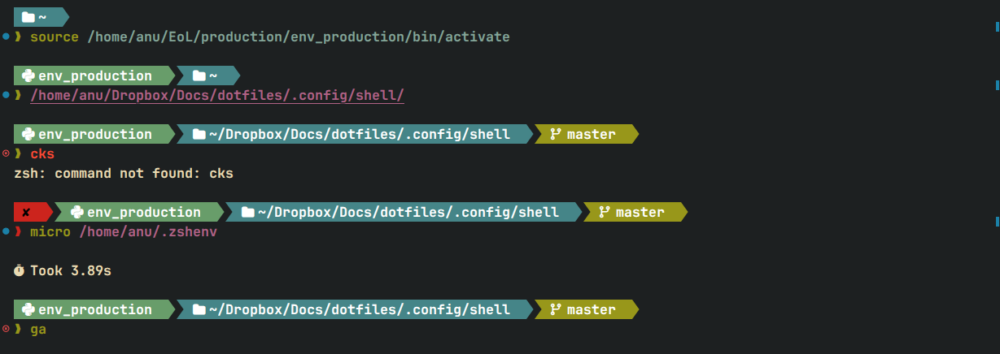
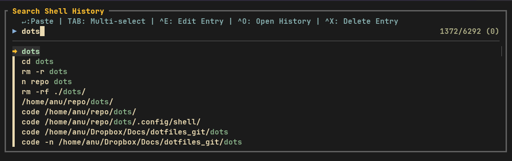

# Shell Dotfiles

A lightweight, plugin-free shell configuration for **Zsh** and **Bash**.
No frameworks, no bloat, just clean shell scripting with powerful fuzzy-finding and git integrations.

---

## Highlights

- **Zero frameworks** — no oh-my-zsh, no oh-my-bash, no slow plugin managers
- **Cross-shell** — functions, aliases, and history shared between Bash and Zsh
- **XDG compliant** — keeps `$HOME` clean by redirecting 25+ app configs to proper XDG directories
- **Platform aware** — works on Linux, macOS, and WSL with auto-detection
- **Git-first workflow** — interactive staging, log browsing, branch switching, all powered by fzf

---

## Prerequisites

| Tool                                                  | Purpose                                              |
|-------------------------------------------------------|------------------------------------------------------|
| [Nerd Font](https://github.com/ryanoasis/nerd-fonts)  | Renders glyphs and icons in the prompt               |
| [fzf](https://github.com/junegunn/fzf)                | Fuzzy search for history, files, git                 |
| [fd](https://github.com/sharkdp/fd)                   | Fast file finder used by `Ctrl-T`                    |
| [eza](https://github.com/eza-community/eza)           | Modern `ls` replacement with color and icons         |
| [bat](https://github.com/sharkdp/bat)                 | Syntax-highlighted file preview used by `rf()`       |
| [ripgrep](https://github.com/BurntSushi/ripgrep)      | Fast text search used by `rf()`                      |
| [delta](https://github.com/dandavison/delta)          | Pretty git diffs in the interactive staging function |

---

## Directory Structure

```
.config/shell/
│
├── bash/
│   ├── .bashrc ·························· Entry point — main Bash config — sources everything below
│   ├── .bash_exports ···················· Environment variables, XDG paths, PATH
│   ├── .bash_utils ······················ Low-level helpers (clipboard, open, confirm)
│   ├── .bash_history ···················· Ctrl-R fuzzy history search with edit and delete
│   ├── .bash_find ······················· Ctrl-T fuzzy file/dir search and rf() text search
│   ├── .bash_git ························ Interactive git functions (gl, gc, ga, gr, gho, cdgr)
│   ├── .bash_functions ·················· Miscellaneous shell functions
│   ├── .bash_aliases ···················· Shell aliases
│   ├── .bashprompt_theme_cascade ········ Default prompt — agnoster-style segments
│   └── .bashprompt_theme_pure ··········· Alternative prompt — minimal style
│
├── zsh/
│   ├── .zshenv ·························· Entry point — sets ZDOTDIR where zshrc lives, sources exports
│   ├── .zsh_exports ····················· Environment variables, XDG paths, PATH
│   ├── .zshrc ··························· Main Zsh config — sources everything below
│   ├── .zsh_utils ······················· Low-level helpers (clipboard, open, confirm)
│   ├── .zsh_history ····················· Ctrl-R fuzzy history search with edit and delete
│   ├── .zsh_find ························ Ctrl-T fuzzy file/dir search and rf() text search
│   ├── .zsh_git ························· Interactive git functions (gl, gc, ga, gr, gho, cdgr)
│   ├── .zsh_functions ··················· Miscellaneous shell functions
│   ├── .zsh_aliases ····················· Shell aliases
│   ├── .zshprompt_theme_cascade ········· Prompt — agnoster-style segments
│   └── .zshprompt_theme_pure ············ Default prompt — minimal style
│
├── scripts/
│   ├── setup-symlinks ··················· Symlinks dotfiles to ~/.config/
│   ├── setup-identities ················· Git & SSH identity setup
│   └── ...
│
└── starship/
    ├── gaps.toml ························ Starship prompt — agnoster with gaps
    ├── gaps_inverted_arrow.toml ········· Starship prompt — inverted arrow variant
    └── pills.toml ······················· Starship prompt — pill-shaped segments
```

### Load order

```
Zsh                                          │   Bash
───                                          │   ────
~/.zshenv                                    │   ~/.bashrc
 ├─ .zsh_exports                             │        ├─ .bash_exports
 └─ $ZDOTDIR/.zshrc                          │        ├─ .bashprompt_theme_cascade
               ├─ .zshprompt_theme_pure      │        ├─ .bash_utils
               ├─ .zsh_utils                 │        ├─ .bash_git
               ├─ .zsh_git                   │        ├─ .bash_history
               ├─ .zsh_history               │        ├─ .bash_find
               ├─ .zsh_find                  │        ├─ .bash_functions
               ├─ .zsh_functions             │        └─ .bash_aliases
               └─ .zsh_aliases               │
```

---

## Installation

### 1. Clone the repository

```shell
git clone <URL> "$HOME/repo/"
```

> Replace `$HOME/repo/` with your preferred path.

### 2. Install a Nerd Font

Copy the bundled fonts and refresh the font cache:

```shell
cp -av "$HOME/repo/.local/share/fonts/." "$HOME/.local/share/fonts/"
sudo fc-cache -f
```

Then set your terminal emulator to use one of the installed Nerd Fonts.

### 3. Link your shell config

**Symlink (recommended)** — `$DOTFILE_DIR` resolves automatically from the symlink target, so no manual editing is needed:

```shell
# Zsh
ln -sf "$HOME/repo/.config/shell/zsh/.zshenv" "$HOME/.zshenv"

# Bash
ln -sf "$HOME/repo/.config/shell/bash/.bashrc" "$HOME/.bashrc"
```

**Source** — if you source instead of symlink, edit the `DOTFILE_DIR` fallback path in `.zshenv`/`.bashrc` to match your repo location:

```shell
# Zsh
echo 'source "$HOME/repo/.config/shell/zsh/.zshenv"' >> "$HOME/.zshenv"

# Bash
echo 'source "$HOME/repo/.config/shell/bash/.bashrc"' >> "$HOME/.bashrc"
```

### 4. Reload

```shell
exec "$(ps -p $$ -ocomm=)"
```

---

## Prompt

Two custom, plugin-free prompt themes are included for both **Zsh** and **Bash** with full feature parity. The **Pure** theme is the default for Zsh; **Cascade** is the default for Bash. To switch themes, comment/uncomment the corresponding `source` line in `.zshrc` or `.bashrc`.

### Prompt features

| Feature                       | Zsh | Bash |
|-------------------------------|:---:|:----:|
| Username and hostname         |  +  |  +   |
| Working directory             |  +  |  +   |
| Read-only directory indicator |  +  |  +   |
| Git branch                    |  +  |  +   |
| Git submodule detection       |  +  |  +   |
| Git stash count               |  +  |  +   |
| Python venv indicator         |  +  |  +   |
| Exit status color (green/red) |  +  |  +   |
| Last command duration         |  +  |  +   |
| Background jobs indicator     |  +  |  +   |

### Cascade theme

Like the agnoster theme, but with gaps.



### Pure theme

A minimal variant with the same feature set but a cleaner separator style.


### Starship (alternative)

Starship-based equivalents of the custom themes are available in `starship/`. However, in my experience Starship is noticeably slower than the native plugin-free prompts above.

---

## Keybindings

### `Ctrl-R` — Fuzzy history search

Fuzzy search through shell history with multi-select support. Use `TAB` to select multiple entries, then act on them with any key below. After edits or deletions the history reloads and fzf reopens with the same query.



| Key inside fzf | Action                                                                                    |
|----------------|-------------------------------------------------------------------------------------------|
| `Enter`        | Paste selected command(s) onto the command line (newline-separated)                       |
| `TAB`          | Toggle multi-select on the focused entry                                                  |
| `?`            | Toggle preview                                                                            |
| `Ctrl-E`       | Edit selected entries in `$VISUAL` — originals are removed and edited content is appended |
| `Ctrl-O`       | Open the raw history file in `$VISUAL`                                                    |
| `Ctrl-X`       | Delete selected entry/entries from history                                                |

### `Ctrl-T` — Fuzzy file and directory search

System-wide fuzzy search for files and directories (searches from `/` using `fd`).


| Key inside fzf | Action                                            |
|----------------|---------------------------------------------------|
| `Enter`        | Paste selected path onto command line             |
| `Alt-C`        | `cd` to directory (or parent directory of file)   |
| `Ctrl-S`       | Cycle filter: Directories / Files                 |
| `?`            | Toggle preview                                    |
| `Ctrl-E`       | Open in file explorer                             |
| `Ctrl-V`       | Open in Zed editor                                |
| `Ctrl-N`       | Open in `$VISUAL`                                 |
| `Ctrl-O`       | Open with system default app                      |
| `Ctrl-Y`       | Copy path to clipboard                            |

### `rf` — Live ripgrep text search

Live text search powered by ripgrep with a bat-previewed, fzf-driven interface. Opens matches directly in `$VISUAL` at the matched line. Requires `rg` and `bat`.

```shell
rf           # search in current directory
rf path/     # search in a specific directory
rf file.rs   # search within a single file
```

| Key inside fzf | Action                                      |
|----------------|---------------------------------------------|
| `Enter`        | Open match in `$VISUAL` at the matched line |
| `TAB`          | Toggle selection of a match                 |
| `Alt-A`        | Select all matches                          |
| `Alt-D`        | Deselect all                                |
| `?`            | Toggle preview                              |

When multiple matches are selected, `$VISUAL` is opened with a quickfix list (vim/nvim only).

### Other keybindings

| Key                        | Action                                                                            | Shell |
|----------------------------|-----------------------------------------------------------------------------------|-------|
| `Ctrl-X Ctrl-E`            | Edit the current command line in `$VISUAL` — returns edited content to the prompt | Both  |
| `Up` / `Down`              | Prefix history search — type a prefix, then arrow to filter                       | Both  |
| `Ctrl-Left` / `Ctrl-Right` | Jump word backward / forward                                                      | Both  |
| `Home` / `End`             | Jump to start / end of line                                                       | Both  |
| `Ctrl-Backspace`           | Delete previous word                                                              | Both  |
| `Ctrl-Del`                 | Delete next word                                                                  | Both  |
| `Shift-Tab`                | Reverse-cycle completion menu                                                     | Zsh   |

---

### Interactive git functions

These shell functions use fzf (≥0.58) with section borders, footer hints, ghost text, highlighted lines, and non-blocking header updates.

#### `ga` — Git stage, unstage, and commit

Interactive staging workflow with live status counters in the header and delta-powered diff preview.

| Key inside fzf | Action                                      |
|----------------|---------------------------------------------|
| `Enter`        | Stage selected file(s) or unstage if staged |
| `Ctrl-S`       | Switch between Unstaged / Staged views      |
| `Ctrl-C`       | Commit staged changes (opens `$VISUAL`)     |
| `Alt-A`        | Stage all unstaged files                    |
| `Alt-E`        | Open selected file(s) in `$EDITOR`          |
| `?`            | Toggle diff preview                         |

#### `gc` — Git checkout branches, tags, or commits

Browse and checkout with commit details and diff preview. Supports branch creation and deletion.

| Key inside fzf | Action                                       |
|----------------|----------------------------------------------|
| `Enter`        | Checkout the selected branch, tag, or commit |
| `Ctrl-S`       | Cycle view: Branches / Tags / Recent Commits |
| `Ctrl-N`       | Create a new branch from current HEAD        |
| `Ctrl-O`       | Open the branch, tag, or commit on GitHub    |
| `Alt-X`        | Delete the selected local branch             |
| `?`            | Toggle preview                               |

#### `gl` — Browse git commits

Browse, inspect, and diff commits with delta-powered preview.

| Key inside fzf | Action                                                 |
|----------------|--------------------------------------------------------|
| `Enter`        | Show the commit (full diff via pager)                  |
| `Ctrl-D`       | Diff between that commit and the working tree          |
| `Ctrl-S`       | Toggle branch switcher (pick a branch to view its log) |
| `Ctrl-F`       | Filter commits by author                               |
| `Ctrl-T`       | Filter commits by message                              |
| `Ctrl-Y`       | Copy the commit hash to clipboard                      |
| `Ctrl-O`       | Open the commit on GitHub                              |
| `?`            | Toggle preview                                         |

#### `gr` — List git remotes

Prints each remote on one line, aligned in columns. Shows two lines for a remote only when its push URL differs from its fetch URL.

#### Git utility functions

| Function       | Description                                                   |
|----------------|---------------------------------------------------------------|
| `cdgr`         | `cd` to the outermost git superproject root                   |
| `gho [remote]` | Open the remote repo page (GitHub, GitLab, etc.) in a browser |

#### Other functions

| Function | Description                          |
|----------|--------------------------------------|
| `fkill`  | Find and kill a running process      |
| `sshf`   | SSH into a host from `~/.ssh/config` |

---

### Utility functions

| Function                  | Description                                                              |
|---------------------------|--------------------------------------------------------------------------|
| `open_command <file>`     | Open a file or URL in the system default app (Linux / macOS / WSL aware) |
| `open_path <file>`        | Open the containing directory in a file manager                          |
| `detect_clipboard`        | Auto-detect the clipboard command (Wayland / X11 / macOS / WSL / tmux)   |
| `copyabsolutepath <file>` | Copy the absolute path of a file to the clipboard                        |
| `confirm <prompt>`        | Show a Y/N confirmation prompt                                           |

---

## History

Both shells share a single history file at `~/.config/shell/history` (local to each machine, not synced or tracked in git). 
Two behaviors are enforced in both Zsh and Bash to keep it clean:

**No timestamps** — Zsh is configured with `setopt no_extended_history`, and Bash explicitly unsets `HISTTIMEFORMAT`, so `#<timestamp>` lines never appear in the shared file.

**Only successful commands are saved** — commands that fail are kept in the shell's in-memory history (available via arrow keys for the current session) but are never written to the on-disk history file. Ctrl-C (exit 130) is treated as success since the user intentionally interrupted.

- **Zsh** achieves this with the `zshaddhistory` / `precmd` / `zshexit` hooks (see `.zshrc`).
- **Bash** achieves this with a `PROMPT_COMMAND` handler that writes successful commands immediately, an `EXIT` trap that prevents Bash's default flush of in-memory history, and avoidance of `history -a` in the fzf widget (see `.bashrc`).

---

## XDG compliance

Both shells redirect config and cache paths for 25+ applications to proper XDG directories, keeping `$HOME` clean:

`Android` `Ansible` `Aspell` `AWS` `Bash (INPUTRC)` `Docker` `Dotnet` `Git` `GnuPG` `Go` `GTK` `Java` `Kubernetes` `LaTeX` `Less` `Nvidia` `Python` `Jupyter` `Ripgrep` `Rust` `Subversion` `Terminfo` `Tmux` `Wget` and more.

---

## Editor setting

The `EDITOR` and `VISUAL` variables are set automatically based on what's installed, in order of preference:

`fresh` > `nvim` > `vim` > `vi`

---

## Zsh-specific features

**Completion** — case-insensitive, auto-menu on second tab press, colored candidates, auto-slash for directories.

**Globbing** — `extended_glob` enabled (`#`, `~`, `^` patterns), `glob_dots` includes dotfiles.

**Auto-cd** — type a directory path without `cd` to navigate to it.

---
