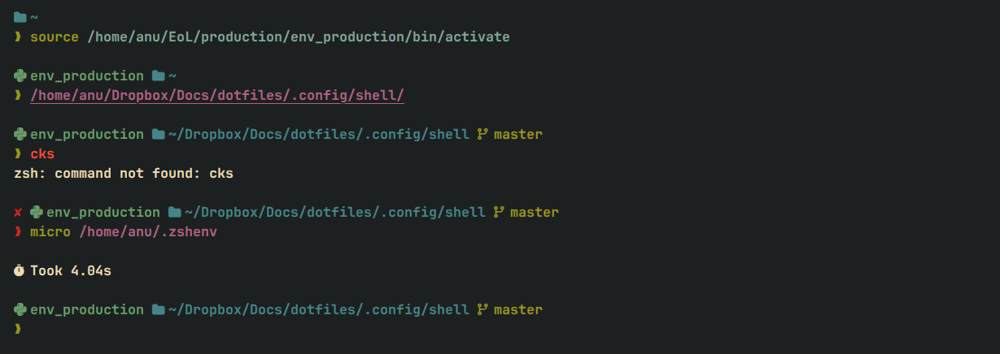
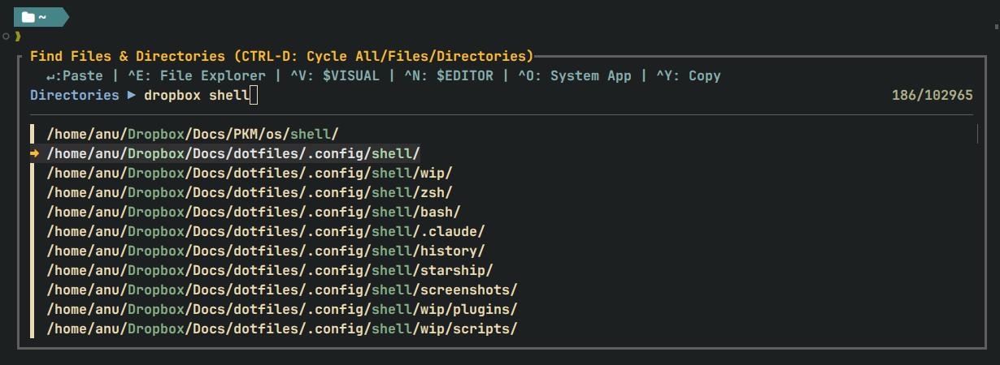

# Dotfiles

Personal dotfiles for a consistent development environment across Ubuntu, Debian, Fedora, and macOS. Applied via symlinks from a single repo — no installation scripts that mutate the repo itself.

---

## Quick Start

On a fresh machine with nothing installed, run this single command:

```sh
curl -fsSL https://raw.githubusercontent.com/anuanandpremji/dots/main/setup.sh -o /tmp/setup.sh && bash /tmp/setup.sh
```

The script will ask how to get the dotfiles (clone via SSH, HTTPS, or download as zip), then walk through identity setup, app installs, and config linking interactively.

```sh
# If the dotfiles repo is already present, run directly
./setup.sh

# Server preset — system packages, SSH, CLI tools, zsh, symlinks (no GUI apps)
./setup.sh server

# Just create symlinks (no app installs)
./scripts/setup_symlinks.sh

# Preview any command without making changes
./setup.sh --dry-run
./setup.sh --help
```

---

## What's Included

| Category  | Content                                                                            |
|-----------|------------------------------------------------------------------------------------|
| Shell     | Zsh + Bash — shared config, aliases, history, fzf integrations, prompt themes      |
| Terminal  | WezTerm (quake-mode dropdown on Linux)                                             |
| Editors   | Neovim, Fresh, VS Code, Zed                                                        |
| CLI Tools | fzf, fd, bat, ripgrep, eza, delta                                                  |
| Git       | Custom config — delta pager, aliases, SSH multi-identity                           |
| GNOME     | Desktop settings, extensions, Calendar, Tweaks, Extension Manager                  |
| Fonts     | Nerd Font collection (JetBrainsMono NL and others)                                 |
| Browsers  | Firefox, Chrome, Brave                                                             |

---

## Shell

A lightweight, plugin-free shell configuration for **Zsh** and **Bash**. No frameworks, no plugin managers — just clean shell scripting with powerful fuzzy-finding and git integrations.

### Highlights

- **Zero frameworks** — no oh-my-zsh, no oh-my-bash, no slow plugin managers
- **Cross-shell** — functions, aliases, and history shared between Bash and Zsh via `shared/`
- **XDG compliant** — keeps `$HOME` clean by redirecting 25+ app configs to proper XDG directories
- **Platform aware** — works on Linux, macOS, and WSL with runtime detection
- **Git-first workflow** — interactive staging, log browsing, branch switching, all in the terminal

### Prerequisites

| Tool                                                 | Purpose                                              |
|------------------------------------------------------|------------------------------------------------------|
| [Nerd Font](https://github.com/ryanoasis/nerd-fonts) | Renders glyphs and icons in the prompt               |
| [fzf](https://github.com/junegunn/fzf)               | Fuzzy search for history, files, git                 |
| [fd](https://github.com/sharkdp/fd)                  | Fast file finder used by `Ctrl-T`                    |
| [eza](https://github.com/eza-community/eza)          | Modern `ls` replacement with color and icons         |
| [bat](https://github.com/sharkdp/bat)                | Syntax-highlighted file preview used by `rf`         |
| [ripgrep](https://github.com/BurntSushi/ripgrep)     | Fast text search used by `rf`                        |
| [delta](https://github.com/dandavison/delta)         | Pretty git diffs in `ga`, `gc`, `gl`                 |

These are installed automatically by `setup.sh cli-apps`. fzf ≥ 0.56 is required — install via `setup.sh`, not the system package manager (distro packages are often years behind).

### Directory structure

```
.config/shell/
│
├── bash/
│   ├── .bashrc ····················· Entry point — Bash config, sources shared/ below
│   ├── .bashprompt_theme_cascade ··· Default prompt — agnoster-style with gaps
│   └── .bashprompt_theme_pure ······ Alternative prompt — minimal style
│
├── zsh/
│   ├── .zshenv ····················· Entry point — sets ZDOTDIR, exports DOTFILES_PATH
│   ├── .zshrc ······················ Main Zsh config — sources shared/ below
│   ├── .zshprompt_theme_cascade ···· Prompt — agnoster-style with gaps
│   └── .zshprompt_theme_pure ······· Default prompt — minimal style
│
└── shared/                           # Sourced by both shells; differences guarded with $ZSH_VERSION / $BASH_VERSION
    ├── exports.sh ·················· Env vars, XDG paths, PATH, EDITOR/VISUAL
    ├── aliases.sh ·················· Shell aliases (ls, git, cd, XDG wrappers, etc.)
    ├── utils.sh ···················· Clipboard, open_command, open_path, confirm, cdgr
    ├── history.sh ·················· Ctrl-R fuzzy history search
    └── find.sh ····················· Ctrl-T fuzzy file/dir search
```

### Load order

```
Zsh                                       │   Bash
───                                       │   ────
~/.zshenv 󰌷 zsh/.zshenv                   │   ~/.bashrc 󰌷 bash/.bashrc
          ├─ shared/exports.sh            │             ├─ shared/exports.sh
          ├─ $ZDOTDIR/.zshrc              │             ├─ bash/.bashprompt_theme_*
          ├─ zsh/.zshprompt_theme_*       │             ├─ shared/utils.sh
          ├─ shared/utils.sh              │             ├─ shared/history.sh
          ├─ shared/history.sh            │             ├─ shared/find.sh
          ├─ shared/find.sh               │             └─ shared/aliases.sh
          └─ shared/aliases.sh            │
```

`DOTFILES_PATH` is resolved automatically by `.zshenv` and `.bashrc` from their own symlink target — no hardcoded paths to edit per machine.

### Prompt

Two custom, plugin-free prompt themes are included for both **Zsh** and **Bash** with full feature parity. To switch themes, comment/uncomment the corresponding `source` line in `.zshrc` or `.bashrc`.

| Feature                       | Zsh | Bash |
|-------------------------------|:---:|:----:|
| Username and hostname         |  +  |  +   |
| Working directory             |  +  |  +   |
| Read-only directory indicator |  +  |  +   |
| Git branch                    |  +  |  +   |
| Git submodule detection       |  +  |  +   |
| Git stash count               |  +  |  +   |
| Python venv indicator         |  +  |  +   |
| Exit status color (green/red) |  +  |  +   |
| Last command duration         |  +  |  +   |
| Background jobs indicator     |  +  |  +   |

#### Cascade theme

Like the agnoster theme, but with gaps between segments.


#### Pure theme

A minimal variant with the same feature set but a cleaner separator style.



#### Starship (alternative)

Starship-based equivalents of both themes are in `.config/shell/starship/`. They are noticeably slower than the native plugin-free themes and are provided as an opt-in alternative only.

---

### Keybindings

#### `Ctrl-R` — Fuzzy history search

Fuzzy search through the shared history file with multi-select support. After edits or deletions, history reloads and fzf reopens with the same query.


| Key      | Action                                                                              |
|----------|-------------------------------------------------------------------------------------|
| `Enter`  | Paste selected command(s) onto the command line (newline-separated if multi-select) |
| `TAB`    | Toggle multi-select on the focused entry                                            |
| `Ctrl-E` | Edit selected entries in `$VISUAL` — originals are replaced with edited content     |
| `Ctrl-O` | Open the raw history file in `$VISUAL`                                              |
| `Ctrl-X` | Delete selected entry/entries from history                                          |
| `?`      | Toggle preview                                                                      |

#### `Ctrl-T` — Fuzzy file and directory search

System-wide fuzzy search for files and directories, starting from `/`.



| Key      | Action                                          |
|----------|-------------------------------------------------|
| `Enter`  | Paste selected path onto the command line       |
| `Alt-C`  | `cd` to directory (or parent directory of file) |
| `Ctrl-S` | Cycle filter: Directories / Files               |
| `Ctrl-V` | Open in Zed editor                              |
| `Ctrl-N` | Open in `$VISUAL`                               |
| `Ctrl-O` | Open with system default app                    |
| `Ctrl-E` | Open in file explorer                           |
| `Ctrl-Y` | Copy path to clipboard                          |
| `?`      | Toggle preview                                  |

#### `rf` — Live ripgrep text search

Live text search powered by ripgrep with a bat-previewed, fzf-driven interface. Opens matches directly in `$VISUAL` at the matched line. Requires `rg` and `bat`.

```sh
rf           # search in current directory
rf path/     # search in a specific directory
rf file.rs   # search within a single file
```

| Key     | Action                                      |
|---------|---------------------------------------------|
| `Enter` | Open match in `$VISUAL` at the matched line |
| `TAB`   | Toggle selection of a match                 |
| `Alt-A` | Select all matches                          |
| `Alt-D` | Deselect all                                |
| `?`     | Toggle preview                              |

When multiple matches are selected, `$VISUAL` is opened with a quickfix list (vim/nvim only).

#### Other keybindings

| Key                        | Action                                                                            | Shell |
|----------------------------|-----------------------------------------------------------------------------------|-------|
| `Ctrl-X Ctrl-E`            | Edit the current command line in `$VISUAL` — returns edited content to the prompt | Both  |
| `Up` / `Down`              | Prefix history search — type a prefix, then arrow to filter                       | Both  |
| `Ctrl-Left` / `Ctrl-Right` | Jump word backward / forward                                                      | Both  |
| `Home` / `End`             | Jump to start / end of line                                                       | Both  |
| `Ctrl-Backspace`           | Delete previous word                                                              | Both  |
| `Ctrl-Del`                 | Delete next word                                                                  | Both  |
| `Shift-Tab`                | Reverse-cycle completion menu                                                     | Zsh   |

---

### Git tools

Interactive git tools powered by fzf ≥ 0.56 with section borders, footer hints, ghost text, and delta diff preview. All live in `.local/bin/` and are symlinked to `~/.local/bin/`.

#### `ga` — Stage, unstage, and commit

Interactive staging workflow with live file status counters in the header and a delta-powered diff preview pane.

| Key      | Action                                                       |
|----------|--------------------------------------------------------------|
| `Enter`  | Stage selected file(s), or unstage if in the Staged view     |
| `Ctrl-S` | Switch between Unstaged / Staged views                       |
| `Ctrl-C` | Commit staged changes (opens `$VISUAL` for commit message)   |
| `Alt-A`  | Stage all unstaged files at once                             |
| `Alt-E`  | Open selected file(s) in `$EDITOR`                           |
| `?`      | Toggle diff preview                                          |

#### `gc` — Checkout branches, tags, or commits

Browse and checkout with commit details and delta diff preview. Supports branch creation and deletion.

| Key      | Action                                       |
|----------|----------------------------------------------|
| `Enter`  | Checkout the selected branch, tag, or commit |
| `Ctrl-S` | Cycle view: Branches / Tags / Recent Commits |
| `Ctrl-N` | Create a new branch from current HEAD        |
| `Ctrl-O` | Open the branch, tag, or commit on GitHub    |
| `Alt-X`  | Delete the selected local branch             |
| `?`      | Toggle preview                               |

#### `gl` — Browse commits

Browse, inspect, and diff commits with delta-powered preview. Toggle to a branch switcher to view any branch's log without leaving the interface.

| Key      | Action                                                 |
|----------|--------------------------------------------------------|
| `Enter`  | Show the commit (full diff via pager)                  |
| `Ctrl-D` | Diff between that commit and the working tree          |
| `Ctrl-S` | Toggle branch switcher (pick a branch to view its log) |
| `Ctrl-F` | Filter commits by author                               |
| `Ctrl-T` | Filter commits by message                              |
| `Ctrl-Y` | Copy the commit hash to clipboard                      |
| `Ctrl-O` | Open the commit on GitHub                              |
| `?`      | Toggle preview                                         |

#### `gr` — List remotes

Prints each remote aligned in columns. Shows two lines for a remote only when its push URL differs from its fetch URL.

#### `gho` — Open repo in browser

Opens the remote repository page in the default browser. Resolves SSH aliases (e.g. `git@github-private:...`) to their real HTTPS URL, appends the current branch path, and handles both GitHub and GitLab URL formats.

```sh
gho           # opens origin at the current branch
gho upstream  # opens a specific remote
```

#### `cdgr` — cd to repo root

`cd` to the outermost git superproject root (follows `git rev-parse --show-superproject-working-tree`).

---

### Utility functions

| Function                  | Description                                                                |
|---------------------------|--------------------------------------------------------------------------  |
| `open_command <path>`     | Open a file, directory, or URL in the system default app (Linux/macOS/WSL) |
| `open_path <path>`        | Open the containing directory in the system file manager                   |
| `detect_clipboard`        | Auto-detect clipboard backend (Wayland / X11 / macOS / WSL / tmux)         |
| `copyabsolutepath <path>` | Copy the absolute path of a file or directory to the clipboard             |
| `confirm <prompt>`        | Show a Y/N prompt and return 0/1                                           |

---

### History

Both shells share a single history file at `$XDG_STATE_HOME/shell/history` (i.e. `~/.local/state/shell/history`). It is local to each machine and not tracked in git.

**No timestamps** — Zsh uses `setopt no_extended_history`; Bash unsets `HISTTIMEFORMAT`. Neither shell writes `#<timestamp>` lines to the shared file.

**Only successful commands are saved** — failed commands stay in the in-memory history for the current session (accessible via arrow keys) but are never written to disk. `Ctrl-C` (exit 130) counts as success.

- **Zsh** uses the `zshaddhistory` hook to intercept commands before they are written.
- **Bash** uses a `PROMPT_COMMAND` handler that writes each successful command immediately, plus an `EXIT` trap that prevents Bash from flushing its in-memory history (which includes failures) to disk on exit.

---

### XDG compliance

Both shells redirect config and state paths for 25+ applications to proper XDG directories, keeping `$HOME` clean:

`Android` `Ansible` `Aspell` `AWS` `Bash` `Docker` `Dotnet` `Git` `GnuPG` `Go` `GTK` `Java` `Kubernetes` `LaTeX` `Less` `Nvidia` `Python` `Jupyter` `Ripgrep` `Rust` `Subversion` `Terminfo` `Tmux` `Wget` and more.

---

### Editor setup

`EDITOR` and `VISUAL` are set automatically based on what's installed, in order of preference:

| Variable  | Preference order                          |
|-----------|-------------------------------------------|
| `EDITOR`  | `fresh` > `micro` > `nvim` > `vim` > `vi` |
| `VISUAL`  | `zed` > `code` > `$EDITOR`                |

---

### Zsh-specific features

**Completion** — case-insensitive, auto-menu on second tab press, colored candidates, auto-slash for directories.

**Globbing** — `extended_glob` enabled (`#`, `~`, `^` patterns), `glob_dots` includes dotfiles in glob expansion.

**Auto-cd** — type a directory path without `cd` to navigate to it.

---

## Installation

### 1. Clone the repository

```sh
git clone <URL> "$HOME/private/dots/"
```

Or use `setup.sh` from the Quick Start above — it handles cloning automatically.

### 2. Run setup

```sh
cd "$HOME/private/dots"
./setup.sh          # full interactive setup
./setup.sh server   # headless server (no GUI)
./setup.sh --help   # list all commands
```

### 3. Link shell config manually (optional)

`setup.sh symlinks` handles this, but if you want to link only the shell:

> [!WARNING]
> This will replace your existing `~/.zshenv` and `~/.bashrc`. Back them up first:
> ```shell
> cp ~/.zshenv ~/.zshenv.bak 2>/dev/null; cp ~/.bashrc ~/.bashrc.bak 2>/dev/null
> ```

```sh
# Zsh
ln -sf "$HOME/private/dots/.config/shell/zsh/.zshenv" "$HOME/.zshenv"

# Bash
ln -sf "$HOME/private/dots/.config/shell/bash/.bashrc" "$HOME/.bashrc"
```

`$DOTFILES_PATH` is resolved automatically from the symlink target — no hardcoded paths.

### 4. Reload

```sh
exec "$(ps -p $$ -ocomm=)"
```

---

## Repository structure

```
dots/
├── setup.sh                        # Orchestrator — runs all sub-scripts
├── scripts/                        # Setup and maintenance scripts (not in PATH)
│   ├── setup_system.sh             # Base packages, package manager bootstrap
│   ├── setup_identities.sh         # SSH keys and git identities
│   ├── setup_apps_cli.sh           # CLI tools (fzf, fd, bat, ripgrep, eza, delta, nvim)
│   ├── setup_apps_gui.sh           # GUI apps (WezTerm, Zed, VS Code, browsers)
│   ├── setup_gnome.sh              # GNOME extensions and dconf settings
│   ├── setup_macos.sh              # macOS Homebrew casks
│   ├── setup_fonts.sh              # Nerd Font installation
│   ├── setup_zsh.sh                # Install zsh and set as default shell
│   └── setup_symlinks.sh           # Symlink configs to ~/.config/ and ~/.local/bin/
│
├── .config/
│   ├── shell/                      # Shell config (see Shell section above)
│   │   ├── bash/
│   │   ├── zsh/
│   │   └── shared/
│   ├── git/                        # Git config, aliases, delta pager, multi-identity
│   ├── wezterm/                    # WezTerm terminal config (Lua)
│   ├── nvim/                       # Neovim config
│   ├── fresh/                      # Fresh editor config
│   ├── vscode/                     # VS Code settings and keybindings
│   ├── zed/                        # Zed editor settings, keymap, themes
│   ├── gnome/                      # GNOME desktop and extension settings
│   └── claude/                     # Claude Code settings
│
├── .local/
│   ├── bin/                        # Daily-use tools — each file symlinked to ~/.local/bin/
│   │   ├── gl, gc, ga              # Git: log browser, checkout, staging
│   │   ├── gr, gho                 # Git: list remotes, open in browser
│   │   ├── ipa                     # Formatted network interface summary
│   │   ├── fkill                   # Fuzzy process kill
│   │   ├── launch                  # Run a command detached from the terminal
│   │   ├── rf                      # Live ripgrep search (fzf + bat)
│   │   ├── shwifi                  # Show saved Wi-Fi passwords
│   │   ├── sshf                    # Fuzzy SSH from ~/.ssh/config
│   │   ├── sysinfo                 # System information summary
│   │   ├── tre                     # Better `tree` (color, hidden files, pager)
│   │   ├── upgrade                 # Update all detected package managers
│   │   └── wezterm-dropdown        # WezTerm quake-mode launcher (Linux)
│   └── share/
│       ├── applications/           # Desktop entries
│       └── fonts/                  # Nerd Fonts
│
└── screenshots/                    # README screenshots
```

## How configs are applied

- **Symlinked** — Shell, Git, WezTerm, Neovim, Zed, Fresh, VS Code, Micro, Claude Code, scripts. The dotfiles directory is the source of truth; `~/.config/` contains symlinks pointing here.
- **dconf-loaded** — GNOME settings and extensions. These use `dconf load` from `.dconf` backup files since they don't read plain config files.
- **Copied** — Fonts are copied to `~/.local/share/fonts/` (symlinks don't work with `fc-cache`).
- **macOS differences** — dconf sections are skipped; VS Code symlinks point to `~/Library/Application Support/Code/User/`; fonts are copied to `~/Library/Fonts/`.
